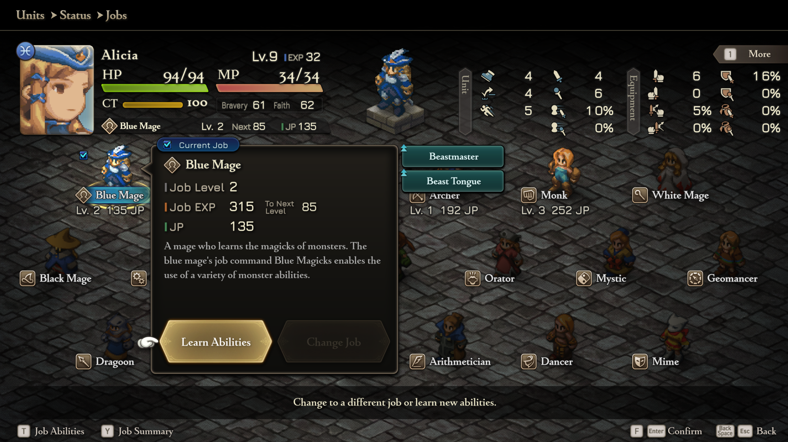

# FFT Blue and Red Mages

A [Reloaded-II](https://github.com/Reloaded-Project/Reloaded-II) mod for **FINAL FANTASY TACTICS - The Ivalice Chronicles** (Steam, enhanced mode) that gives Alicia and Lavian two new jobs:

- **Blue Mage** (Alicia): learns monster abilities by being hit by them. The *Blue Magicks* command covers healing, buffs and damage.
- **Red Mage** (Lavian): a hybrid caster whose *Dualcast* support ability lets her ready two spells at once.



## Features

- Two new jobs in unused special job slots, with their own sprites and portraits.
- **Replenish MP** (reaction): restores MP equal to half the HP damage taken. It triggers like Gil Snapper (on HP damage, Brave% chance).
- **Dualcast** (support): after readying a spell, the unit gets a second pick and can ready another one. Both spells show on the turn order. A *Cancel Casting* row drops the readied spell without using up the unit's action.
- **Cross-job learning**: learn-on-hit abilities (Blue Magicks, Summons, Ultima) can also be learned through the *secondary* skillset. For example, Ramza can learn Ultima with Mettle set as secondary, even when he isn't a Gallant Knight.
- **Mighty Guard** is a green Dragon Beastmaster skill (it replaces Tail Sweep).
- Some Blue Magicks cast instantly: Goblin Punch, Drain Touch, Water Anima.
- Monster rebalances based on Lion War: ReMixed.

## Installation

1. Install [Reloaded-II](https://github.com/Reloaded-Project/Reloaded-II) and add `FFT_enhanced.exe`.
2. Download the latest release and drag the archive into Reloaded-II, or extract it into `Reloaded-II/Mods/`.
3. Enable **FFT Blue and Red Mages**. Reloaded-II downloads these dependencies automatically:
   - [fftivc.utility.modloader](https://github.com/Nenkai/fftivc.utility.modloader)
   - [Reloaded.Memory.SigScan.ReloadedII](https://github.com/Reloaded-Project/Reloaded.Memory.SigScan)
   - [reloaded.sharedlib.hooks](https://github.com/Sewer56/Reloaded.SharedLib.Hooks.ReloadedII)

> The Blue Mage job was moved from Valmafra to an empty job slot (56, `0x38`) in 3.0.0. If you recruited Alicia with an earlier version, update her job with a memory editor.

## Repository layout

| Path | Contents |
|---|---|
| `*.cs` | Mod code. `Mod.cs` patches the hardcoded tables (status inflicts, sprites, sprite sheet types, portraits). `Dualcast.cs`, `ReplenishMp.cs` and `SecondaryLearning.cs` implement those abilities with hooks. |
| `Template/` | Reloaded-II mod template boilerplate. |
| `FFTIVC/tables/enhanced/` | Table edits (jobs, abilities, job commands, monster skillsets) applied by fftivc.utility.modloader. |
| `FFTIVC/data/enhanced/` | Nex tables (`nxd/`), unit sprites, sprite sheet textures and portraits served by fftivc.utility.modloader. |
| `extras/PixelPack/` | Alternate sprite and texture files. They aren't part of the default build. |
| `docs/images/` | Screenshots. |
| `ModConfig.json` | Reloaded-II mod manifest (id `fftivc.jobs.bluemage`). |
| `Publish.ps1`, `BuildLinked.ps1` | Reloaded-II packaging and local deploy scripts. |

## Building

You need the [.NET 9 SDK](https://dotnet.microsoft.com/download). Set `RELOADEDIIMODS` to your `Reloaded-II/Mods` folder, then run:

```powershell
dotnet build BlueMage.csproj            # builds into $env:RELOADEDIIMODS/fftivc.jobs.bluemage
./BuildLinked.ps1                       # trimmed release build into the same folder
./Publish.ps1                           # release packages in Publish/ToUpload
```

Pushing a tag runs the GitHub Actions workflow (`.github/workflows/reloaded.yml`), which builds the mod and attaches it to a GitHub release.

Hooked functions are located by signature. A few data structures are addressed by RVA (the `RVA_*` constants in `Dualcast.cs`), so check those first after a game update.

## Credits

- **Nyzer**: the monster rebalances come from his Lion War: ReMixed mod, and his Dualcast code made this mod's Dualcast possible.
- **kwent**: the original Alicia and Lavian sprites and portraits.
- **UrbanGarlic**: modified sprites and portraits, and lots of testing.
- The **FFHacktics** Discord, for all their help.
